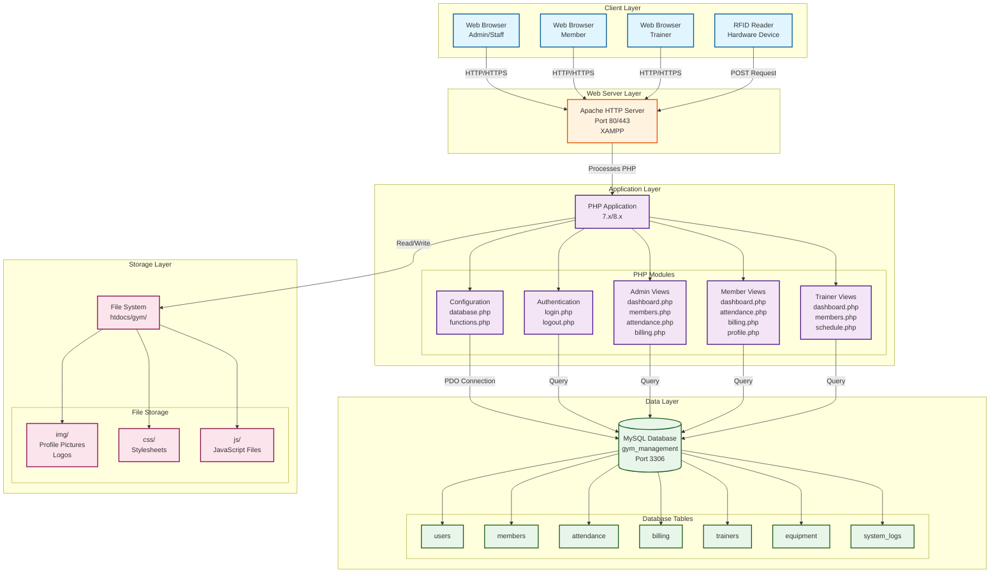

# UEP Fitness Gym Management System - Deployment Diagram

## Deployment Architecture

## Current Deployment Environment

### Development Environment (XAMPP)
- **Web Server**: Apache (via XAMPP)
- **Application Server**: PHP (via XAMPP)
- **Database Server**: MySQL (via XAMPP)
- **Host**: localhost
- **Port**: 80 (HTTP)
- **Database Port**: 3306

### Technology Stack
- **Backend**: PHP 7.x/8.x
- **Database**: MySQL (gym_management)
- **Frontend**: HTML5, CSS3, JavaScript
- **CSS Framework**: Tailwind CSS (CDN)
- **Session Management**: PHP Sessions
- **Database Access**: PDO (PHP Data Objects)

## Component Descriptions

### Client Layer
- **Web Browsers**: Access the application via HTTP/HTTPS
- **RFID Reader**: Hardware device for member check-in/check-out

### Web Server Layer
- **Apache HTTP Server**: Handles HTTP requests and serves static files
- **PHP Module**: Processes PHP scripts server-side

### Application Layer
- **Authentication Module**: Handles user login/logout and session management
- **Admin Views**: Dashboard, members management, attendance, billing, equipment, trainers, vitals, progress
- **Member Views**: Dashboard, attendance, billing, profile, progress, vitals
- **Trainer Views**: Dashboard, members, attendance, schedule, progress, profile
- **Configuration**: Database connection and utility functions

### Data Layer
- **MySQL Database**: Stores all application data
- **Tables**: users, members, attendance, billing, trainers, equipment, system_logs, and more

### Storage Layer
- **File System**: Stores static assets (images, CSS, JavaScript files)
- **Profile Pictures**: User and member profile images
- **Static Assets**: CSS stylesheets and JavaScript files

## Deployment Notes

### Current Setup
- Single-server deployment (all components on localhost via XAMPP)
- Development environment configuration
- Database credentials: root user with no password (default XAMPP)

### Production Considerations
1. **Security**: Change default database credentials
2. **HTTPS**: Enable SSL/TLS certificates
3. **Database**: Separate database server for better performance
4. **Load Balancing**: Multiple web servers for high availability
5. **Backup**: Regular database and file backups
6. **Monitoring**: Application and server monitoring tools
7. **Firewall**: Configure firewall rules for database access

## Network Flow

1. **User Request**: Browser sends HTTP request to Apache
2. **Request Processing**: Apache forwards PHP requests to PHP interpreter
3. **Application Logic**: PHP executes application code
4. **Database Query**: PHP uses PDO to query MySQL database
5. **Response Generation**: PHP generates HTML response
6. **Response Delivery**: Apache sends response back to browser
7. **File Serving**: Static files (CSS, JS, images) served directly by Apache

## Port Configuration

- **HTTP**: Port 80
- **HTTPS**: Port 443 (if SSL configured)
- **MySQL**: Port 3306
- **Apache**: Port 80/443

